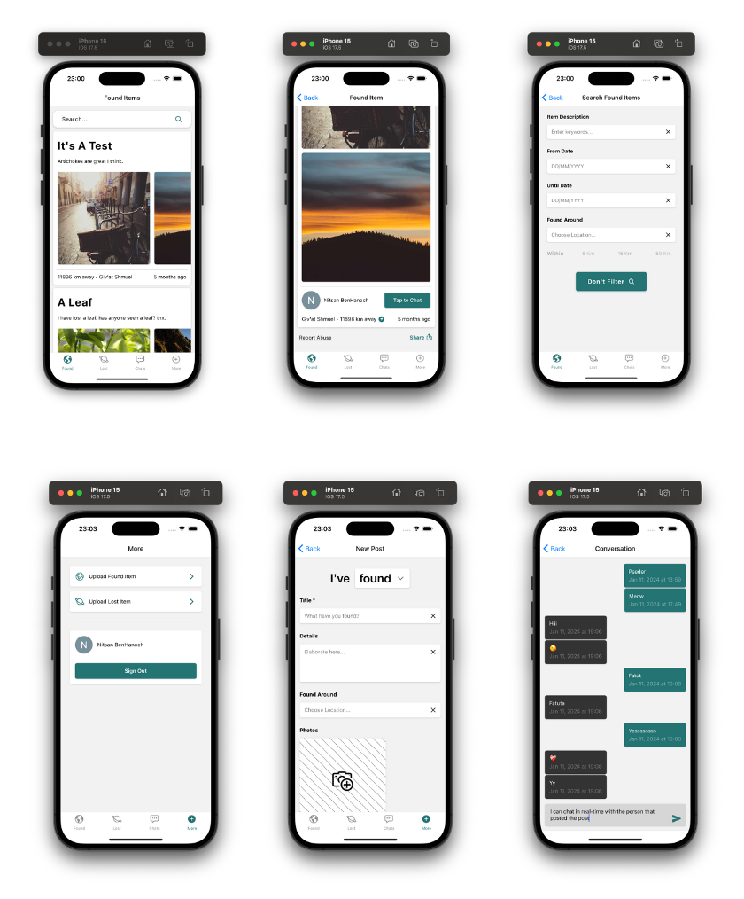

# Lost & Found

A React-Native app for Lost & Found items.

Works on iOS, Android and Web.

Backend hosted on Vercel, and uses MongoDB (for posts), Cloudinary (for hosting images), Firebase (for real-time chat, and authenticating user), and OpenAI API (for tagging images).

Demo on YouTube (Hebrew):

## Features

* **Post Lost/Found Items**: Users can easily post items they have found or are missing.

* **Real-Time Chat**: Message the poster of an item directly through the app's built-in chat feature.

* **One-Tap Login**: Quick and secure access with Google authentication.

* **Full Cross-Platform Compatibility**: Seamlessly works and maintains a consistent, high-quality look across iOS, Android, and Web platforms.

* **AI-Powered Tagging**: The app uses AI to automatically add textual tags to posts based on images, enabling searches for items using terms like "car keys" or "card", even if the post includes only images.

* **Advanced Search Options**: Search for items by text (augmented by AI), date, or location.

## Screenshots

